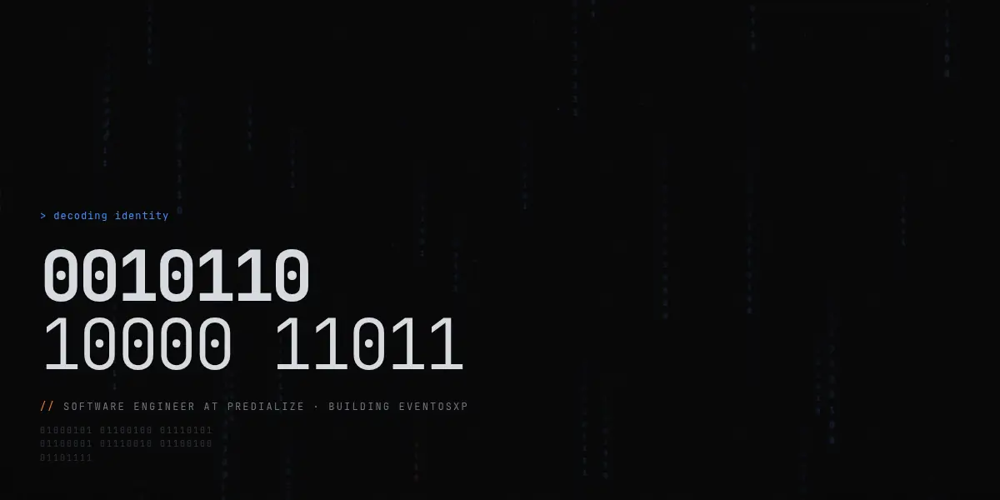

```console
$ cat now
building ai agents and ai workflows · software engineer @ predialize · building eventosxp
```

[linkedin](https://www.linkedin.com/in/eduardopireslucio/) · [strava](https://www.strava.com/athletes/3400462) · [eventosxp](https://www.eventosxp.com.br/)
